### HTB-SKILLS-ASSESSMENT

**DESCRIPTION**
A team member started a Penetration Test against the Inlanefreight environment but was moved to another project at the last minute. Luckily for us, they left a `web shell` in place for us to get back into the network so we can pick up where they left off. We need to leverage the web shell to continue enumerating the hosts, identifying common services, and using those services/protocols to pivot into the internal networks of Inlanefreight.

Sample of the network
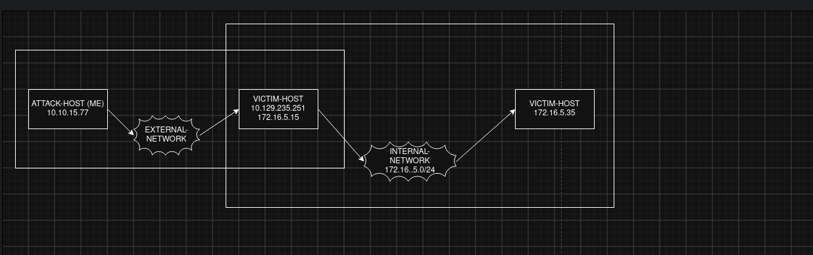

**QUESTIONS**

---

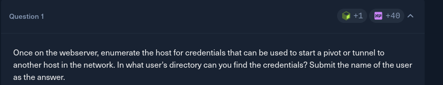

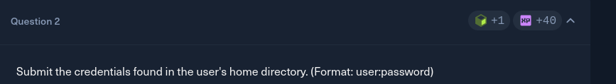

There is nothing of interest inside administrator directory, but something inside webadmin. The user:pass is -> mlefay:Plain Human Work!

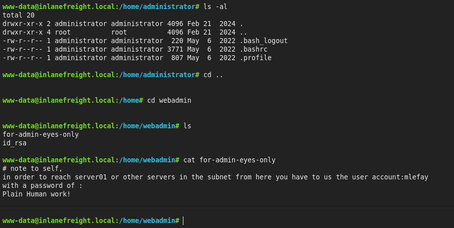

---

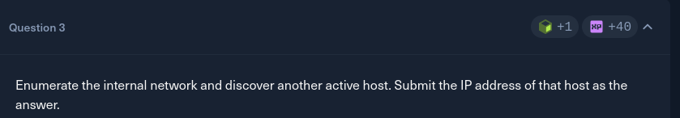

Firstly, i create a Meterpreter shell for the Ubuntu server, which will connect back to us at port 8080.

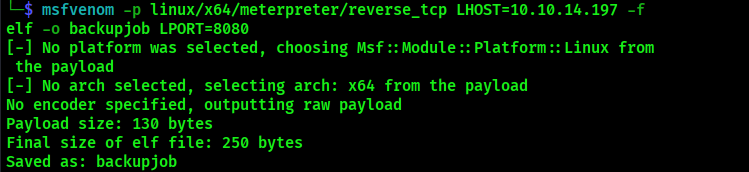

Afterwards i start a generic payload listener so that linux connects back to me when i run backupjob.

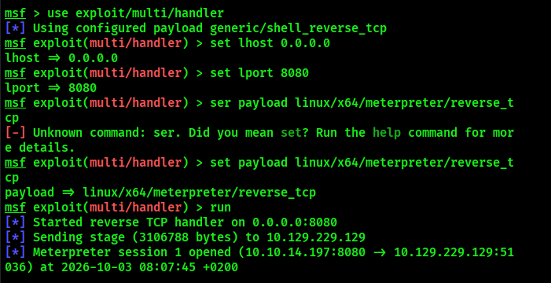

I will start a python server where i created the meterpreter shell for ubuntu and then download it to the initial target.

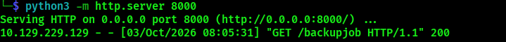

I have no "Write" permissions inside webadmin directory, so i will go back to /var/www/html directory where i have write permissions, and i will download the backupjob in there.

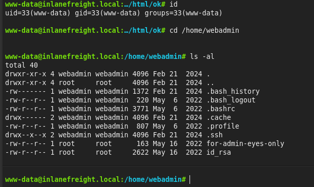
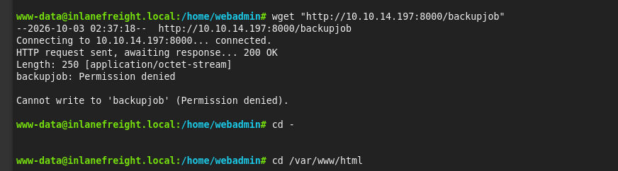
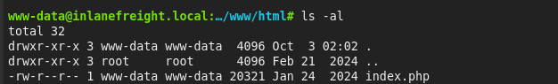

After downloading backupjob, i run it and it connects back to me. 
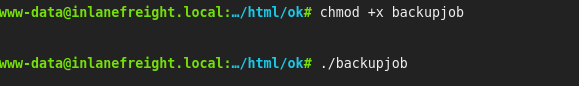

**ENUMERATE INTERNAL HOSTS**

The initial host's internal ip is "172.16.5.15/16 brd 172.16.255.255". I will reduce the number of hosts to enumerate.
Initially we have network-addr 172.16.0.0/16 to enumerate, but its too much...
I will start with 172.16.5.0/24. And i expect the internal IPs to be between 172.16.5.1 and 172.16.5.254.

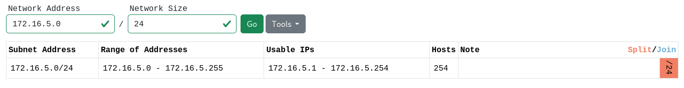

I will use ping_sweep to enumerate internal hosts. 
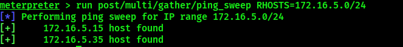

The initial target host's internal ip is 172.16.5.15 and we have another one at 172.16.5.35.

---

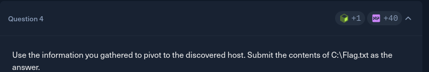

I will background my session and continue using MSF and configure it to  use SOCKS Proxy.
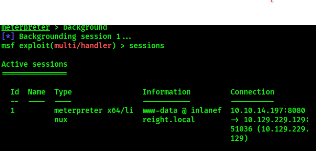
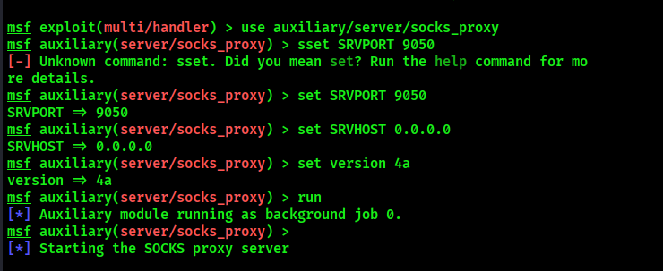
I also configure proxychains in my attack host
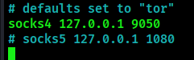

Afterwards i add routes.

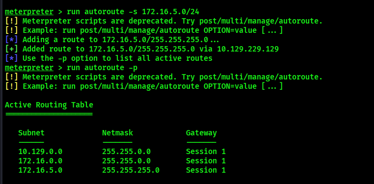

Then i connect to the internal host at 172.16.5.35  using my proxychains4.

The first command failed with some errors including a "Timeout waiting for activation" error. After  some trial and error i used the second command.  

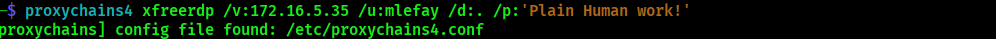
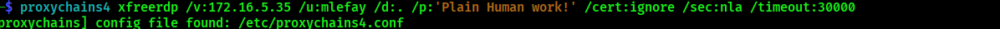

The flag::
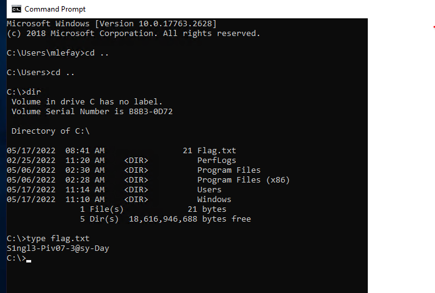

---
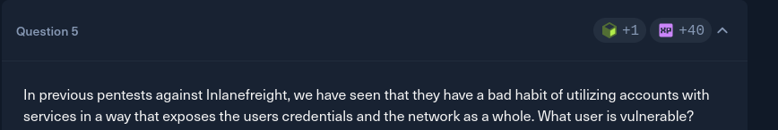

The hint is "We may be able to find something stored in LSASS."
More on the issue: https://redcanary.com/threat-detection-report/techniques/lsass-memory/

Firstly, i create a damp file (.DMP) for lsass within the RDP session from question 4. 
Then i copy it to my linux (attack host). And then i extract creds using pypykatz.

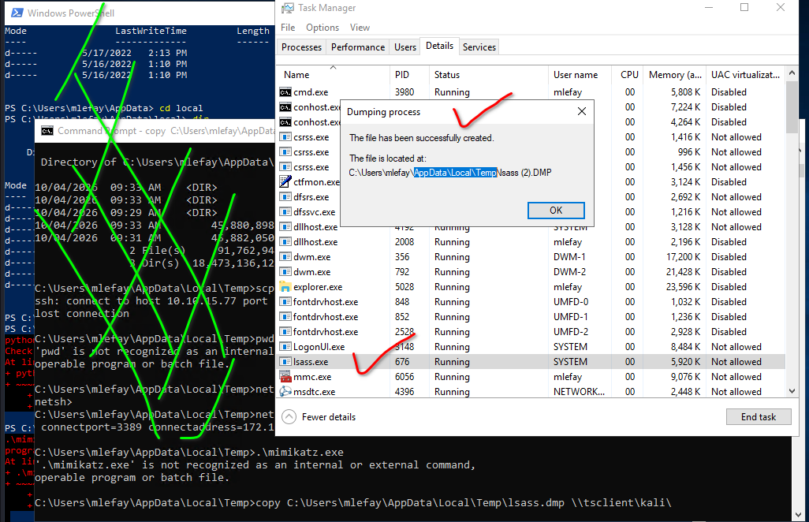
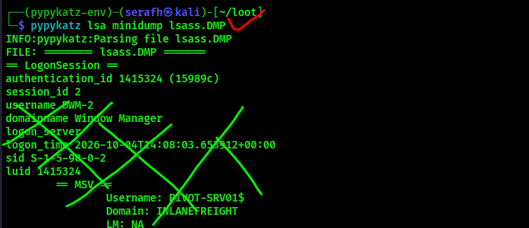

And our vulnerable user is vfrank.

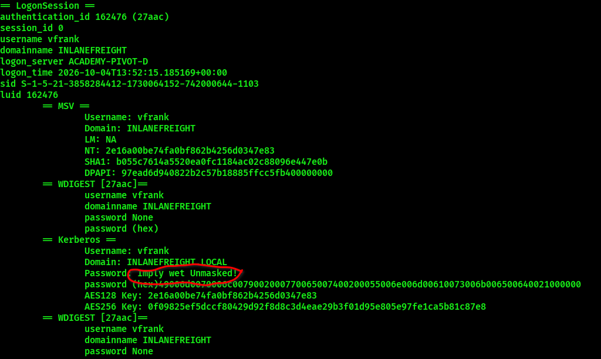

