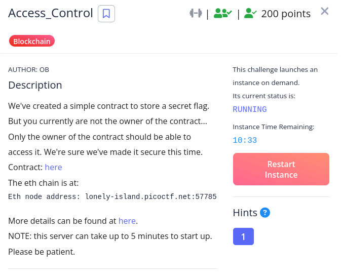
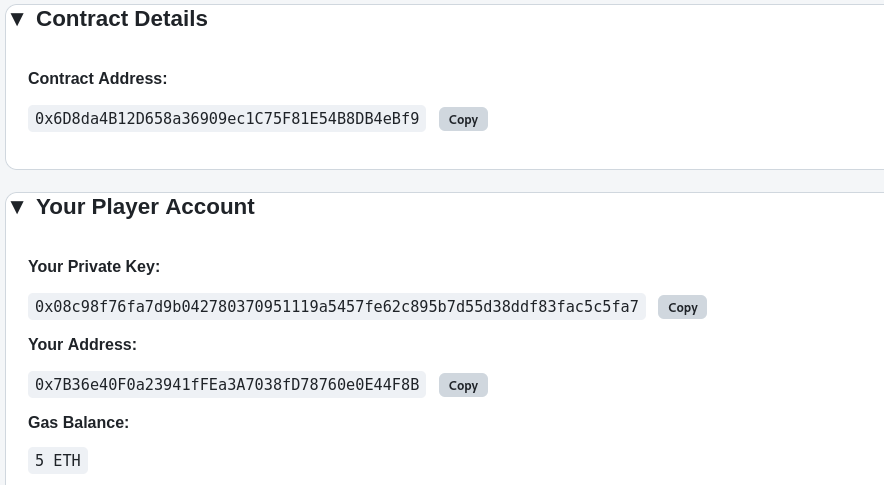
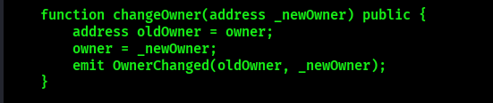
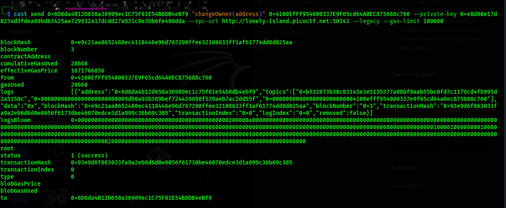
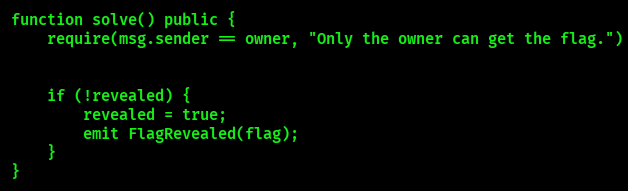
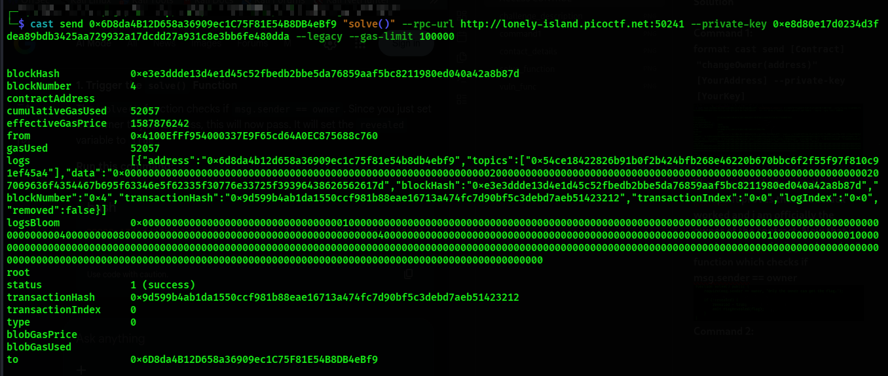
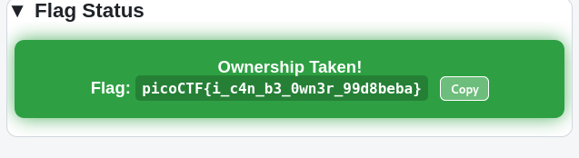

CHALLENGE DESCRIPTION
The target contract contains a critical vulnerability in its access control mechanism. Specifically, the `changeOwner` function is marked as `public` but lacks any `require` statements or modifiers. This allows **any external caller** to invoke the function and set themselves as the contract owner.

CONTACT DETAILS

- **The Contract Address**: **`0x6D8da4B12D658a36909ec1C75F81E54B8DB4eBf9`** is the physical location of a digital safe
- **Player Address**:**`0x7B36e40F0a23941fFEa3A7038fD78760e0E44F8B`** is my public identity on this blockchain
- **Private Key**: `0x7B36e40F0a23941fFEa3A7038fD78760e0E44F8B` is the secret password that proves i own the player address
- **Gas Balance**:  Fuel for the network. Every time i change something on a blockchain, i have to pay the small fee to process the request.

**The Vulnerability**

The changeOwnder function is marked as public, but it lacks require statements of modifiers. This means anyone can call this function and set themselves as the owner.

**Solution**

**Command 1:
format: `cast send [Contract] "changeOwner(address)" [YourAddress] --private-key [YourKey]`

The output is the transaction reciept. It proves that the attack worked and i am officially the owner of the contract. Now that i am the ownner. I trigger the solve() function which checks if msg.sender == owner

Command 2:
Format: cast send [Contract] "solve()" --rpc-url [myurl] --private-key [ privatekey ] --legacy --gas-limit [gaslimit]

The flag is hidden in behind the require(revealed, "challenge not yet solved") check.

**Flag**

After sending Command 2 we get the flag.

**Conclusion**/**Lesson Learnt**
Functions that modify critical state variables must always be protected by requeire statements or modifiers like onlyOwner.
