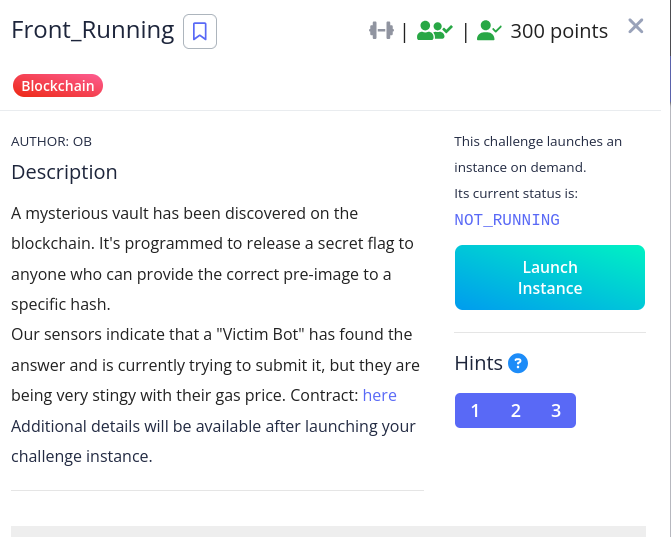
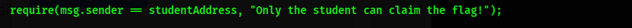
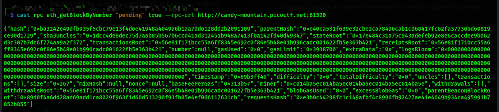
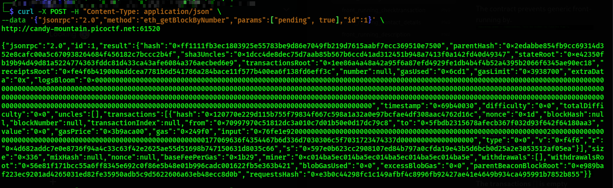
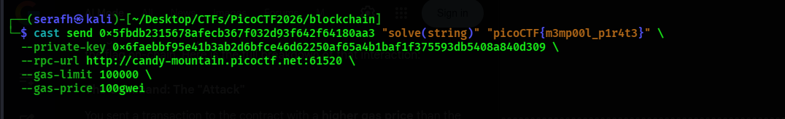
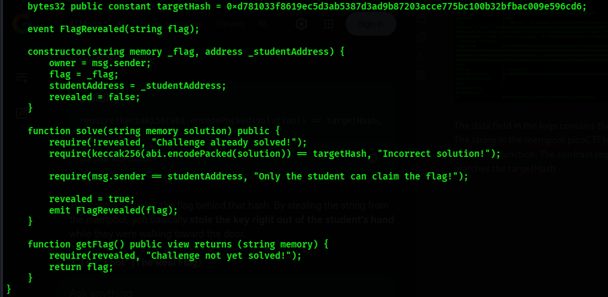
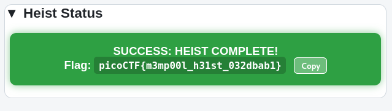

**NOTE:Front Running in blockchain is when someone exploits knowledge of a  pending transaction in the mempool to execute their own transaction first, usually by paying higher gas fee, in order to gain unfair advantage or profit.  In this challenge, front running happens because the contract required a secret string as input to the solve() function, but the string was visible in the mempool before the transaction was confirmed, therefore, its about information leakage.

**Description**
When a transaction is sent to the blockchain, it first enters the **mempool** (a waiting room) before being picked up by miners. During this time, the transaction data is publicly visible, which can lead to **front‑running attacks** if sensitive information is exposed.

The target contract attempts to prevent generic front‑running, but it still leaks critical information.

**Vulnerability**
The vulnerability lies in **information leakage**. As soon as a transaction is broadcast, its input data is visible in the mempool. In this challenge, the solution string required by the contract was exposed in plain text before confirmation.

**Command 1: Inspect Pending Transactions
cast rpc eth_getBlockByNumber "pending" true --rpc-url http://candy-mountain.picoctf.net:61520

The transactions [] is empty

**Command 2: Extract Input Data
By sending a POST request to the blockchain node with:

The command sends a POST request to blockchain node and sets the header as JSON. 
`"method":"eth_getBlockByNumber"`:This tells the node exactly what actionyou want it to take.
params:["pending", true]: The pending targets the mempool which holds pending transactions
In the input field i found 
"input":"0x76fe1e92000000000000000000000000000000000000000000000000000000000000002000000000000000000000000000000000000000000000000000000000000000177069636f4354467b6d336d7030306c5f7031723474337d000000000000000000 which is hex of `picoCTF{m3mp00l_p1r4t3}`

**Command 2: Solve the Challenge
With the leaked string, we called the contract’s `solve()` function:
Now we solve with command

And output

The data field in the logs contains the real flag. 
The string in the mempool picoCTF{m3mp00l_p1r4t3} was the key to unlock the solve() function. The contract required the specific string because its hash matches the targetHash

**Flag

**Conclusion/Lesson Learnt
Even if the contract tries to prevent front-running, transaction data in the mempool is public. 
Sensitive inputs should never be transmitted directly in the transactions.
