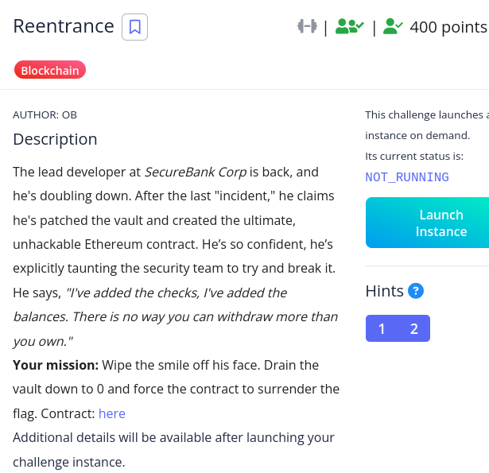
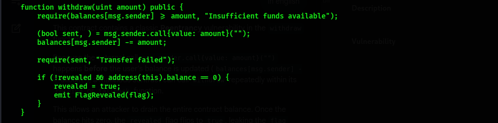
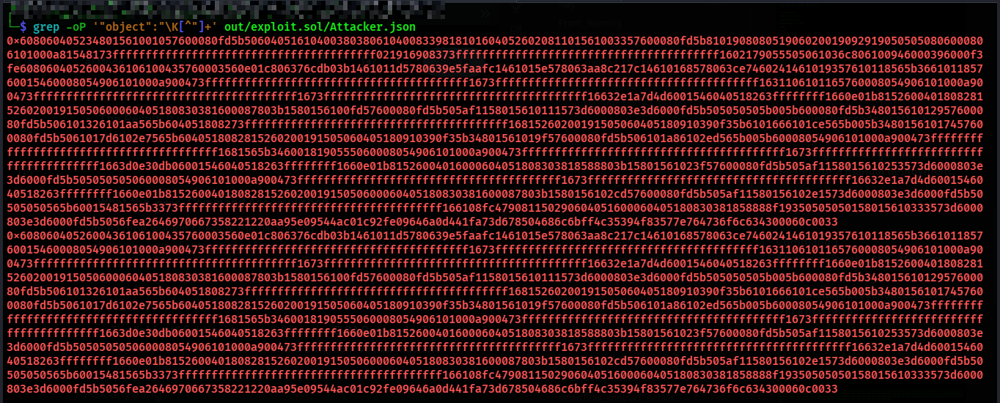
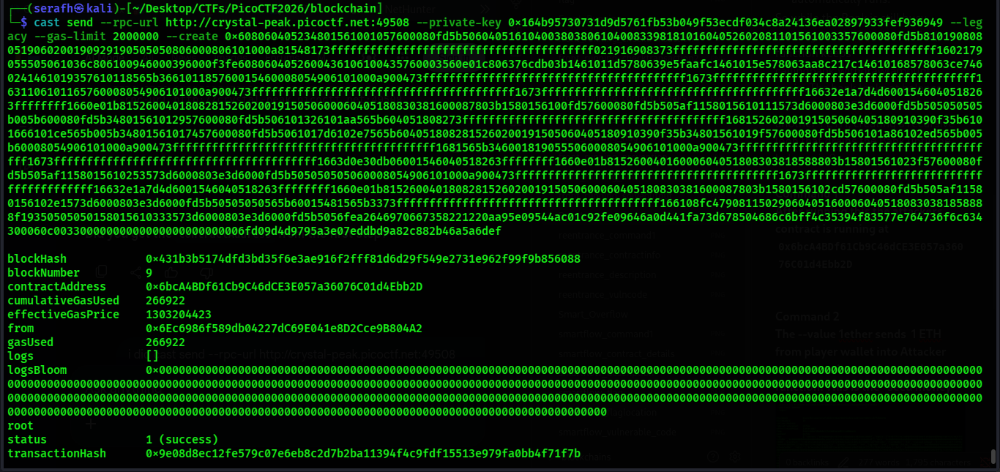
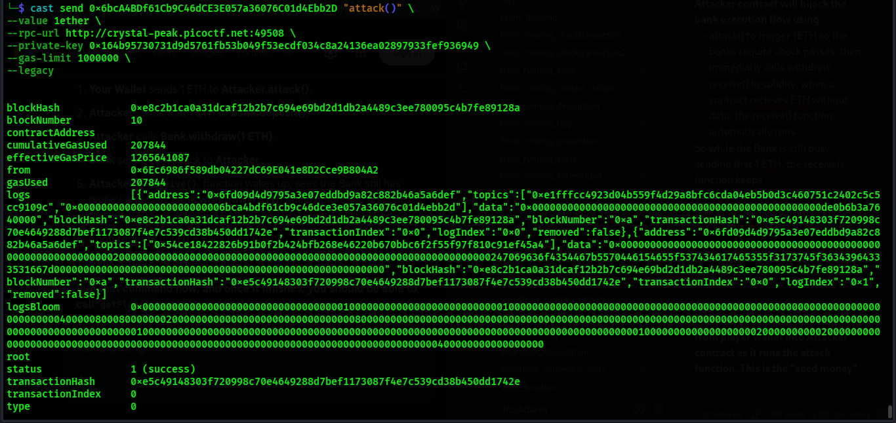
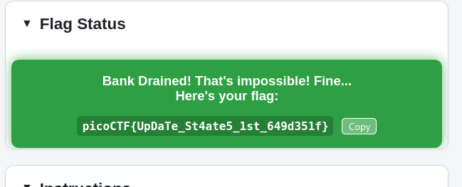

**Description
The contract is vulnerable to a **reentrancy attack** because it performs an external call before updating the user’s balance

**Vulnerability

Because the external call `msg.sender.call{value: amount}("")` happens before the user's balance is updated `balances[msg.sender] -= amount`. A malicious contract can call withdraw repeatedly within its receive or fallback function. This allow an attacker to drain the entire contract balance. Once the balance hits zero, the revealed flag flips to true, leaking the flag

**Exploitation
I used a code to exploit.sol. The Attacker contract will hijack the bank execution flow using 
- attack() to trigger 1ETH so the banks require check passes, then immediatly calls withdraw. 
- receive() In solidity, when a contract recieves ETH without data, the receive() function automatically runs. 
So while the Bank is still busy sending first 1 ETH, the receive() function keeps callingbank.withdraw(amount) again. The bank looks at balance, sees it is still 1 ETH and sends another 1 ETH, creating a recursive loop that drains the Bank until the balance is 0.

**NOTE::
Why the **Attacker contract** is needed:
- Contracts can have a `receive()` function that runs automatically whenever ETH is sent to them.
- Inside `receive()`, the attacker can immediately call `Bank.withdraw()` again before the Bank finishes its first execution.    
- This recursive loop is only possible because the attacker contract acts as a programmable middleman between your wallet and the Bank.
- - A **user wallet** (an externally owned account, EOA) can send ETH and call functions, but it can’t execute code automatically when ETH is received. There’s no `receive()` or `fallback` function in a wallet. So once the Bank sends ETH back, the wallet just passively accepts it — no chance to re‑enter the Bank mid‑transaction.
- An **attacker contract**, on the other hand, is programmable. It _does_ have a `receive()` function that fires automatically when ETH arrives. That’s the hook that lets it immediately call `Bank.withdraw()` again before the Bank finishes its first execution. This is what creates the recursive loop.

**forge create fail

**Compiled bytecode of attacker contract
Since forge failed i got the raw hex needed for a manual deployment.

When compiling exploit.sol, it created a JSON file containing metadata. The JSON field inside that JSON is the EVN Bytecode. 
Block 1 is the deployment bytecode. It is the code that runs once to set up the contract, save variables and store the second block in the blockchain
Block 2 is the runtime bytecode. This is the code that stays on the blockchain forever and contains attack() and receive() functions.

**Command 1
I took the deployment bytecode and append the bankaddress to the end of it.  This will create a new contract with this code.
After running this the attackers contract is running at `0x6bcA4BDf61Cb9C46dCE3E057a36076C01d4Ebb2D`

**Command 2
The --value 1ether sends  1 ETH from player wallet into Attacker contract as it runs the attack function. This is the "seed money" 

What will happen is::
- **Your Wallet** sends 1 ETH to **Attacker.attack()**.
- **Attacker** sends that 1 ETH to **Bank.deposit()**.
- **Attacker** calls **Bank.withdraw(1 ETH)**.
- **Bank** sends 1 ETH back to **Attacker**.
- **Attacker's `receive()`** function wakes up, sees the Bank still has money, and calls **Bank.withdraw(1 ETH)** again before the first one finishes.
- **Loop repeats** until the Bank is empty.
- **Bank** sets `revealed = true`.

**Flag

**Conclusion
This challenge demostrates the classic reentrancy vulnerability in Ethereum smart contracts. By exploiting the order of operations, an attacker can recursively drain funds. 
Always update state before making external calls or use safegurds like ReentrancyGuard or the Checks-Effects-Interactions pattern

**References
https://medium.com/chainwall-io/reentrancy-attack-in-smart-contracts-4837ed0f9d73
https://infosecwriteups.com/reentrancy-attack-on-smart-contract-9f07335053f7
