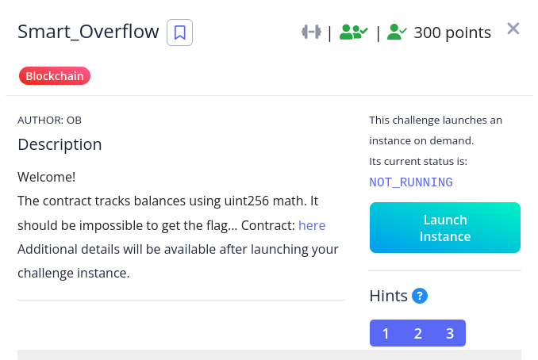
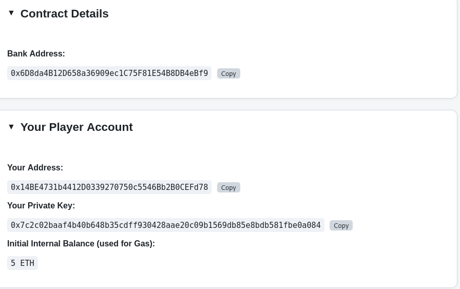
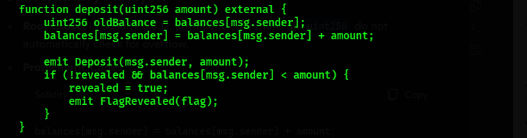
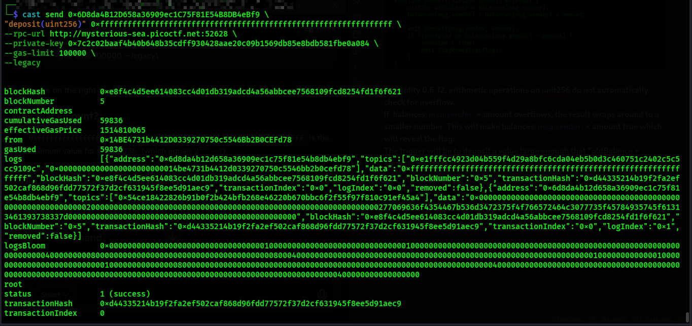
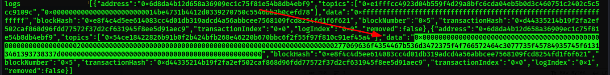
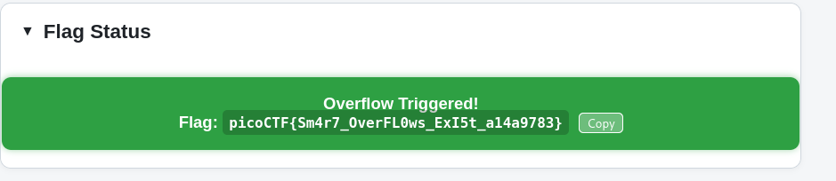

**Description
The contract manages deposits and withdrawals for users. It also contains a hidden flag that is only revealed under certain conditions. The vulnerability lies in how balances are updated during deposits, which can trigger an **integer overflow**

**Vulnerability

**In solidity 0.6.12, arithmetic operations on unit256 do not automatically check for overflow. 
If  balances[msg.sender] + amount overflows, the result wraps around to a smaller number. This will make balances[msg.sender] < amount true which will reveal the flag.
The trigger will be to deposit a value large enough that "oldBalance + amount" exceeds 2^256 - 1.

**Exploitation Flow

**Command 1:
We use the deposit(uint256) 0xffffffffffffffffffffffffffffffffffffffffffffffffffffffffffffffff to deposit the maximum value for a uint256. This will cause the addition to overflow, wrapping the balance back around to a sa=mall number.

**In the logs, the data section will contain the flag in hex

**Flag

**Conclusion/Lesson Learnt
Using SafeMath or upgrading to Solitity 0.8+ which has built-in overflow checks.
For Example::\
function deposit(uint256 amount) external {
    balances[msg.sender] = SafeMath.add(balances[msg.sender], amount);
    emit Deposit(msg.sender, amount);
}

