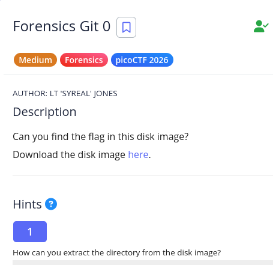
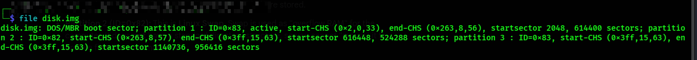
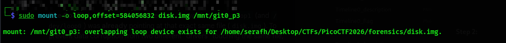
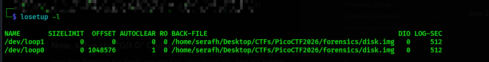
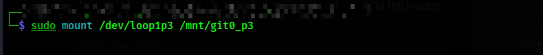
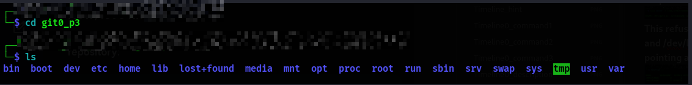
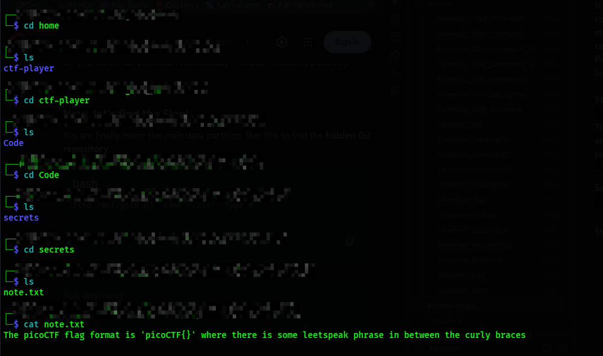
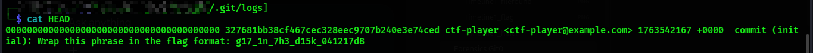

**The hint says to extract the directory from the disk image

**Step1
Looking at the file output

Partition 1 (ID=0x83) is a linux native partition. It behaves like a folder where files and directorues are stored.
Partition 2 (ID=0x82) is Linux swap. It is used as overflow ram for the computer. It does not have standard directory structure so cannot be mounted
Partition 3 (ID=0x83) is another linux native partition.

**Step 2: I create a mount

This refused becayse /dev/loop1 and /dev/loop0 was already pointing at the exact same file.

So instead i used the command

**Step 3: Flag Hunting

**Flag::picoCTF{g17_1n_7h3_d15k_041217d8}

---

**FORENSICS Git 1
![[images/Forensics_Git1_description.png]]

**Step1
![[images/Forensics_Git1_command1.png]]

**Step2
NOTE: Standard Sector Size is 512 bytes
Partition 1, start sector=2048, so
2048(multiply-by)512=1048576
Partition 2, start sector=616448, so
616448(multiply-by)512=315621376
Partition 3, start sector=1140736
so 1140736(multiply-by)512=584056832
![[images/Forensics_Git1_command2.png]]

**Step3
Now i do /mnt/git1_p3/home/ctf-player/Code/secrets/.git

**Step4
![[images/Forensics_Git1_command3.png]]This will show a condensed history of the repository.
5fb8194 is the hash of the current hash and 177789a is the previous version.

**Step5
Now we use "Time Travel" Command to tell Git to change the files in the folder back to how they looked in the 177789a version
![[images/Forensics_Git1_command4.png]]
It will pull the files from that specific moment, and overwrites the current files in your directory

**Step6
![[images/Forensics_Git1_command5.png]]

**The flag is picoCTF{g17_r3m3mb3r5_d4ddf904}

