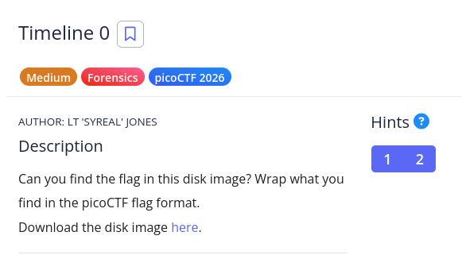
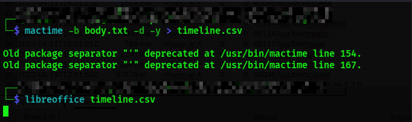
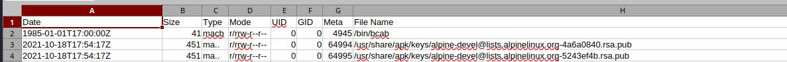
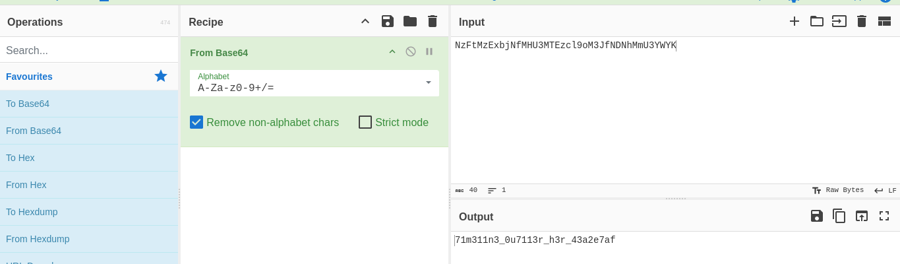
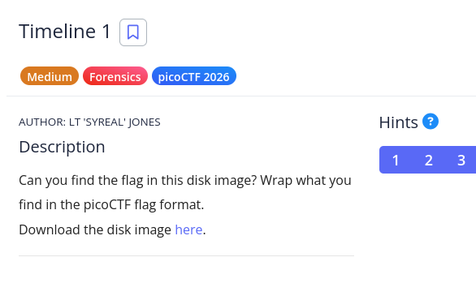
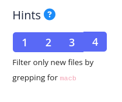
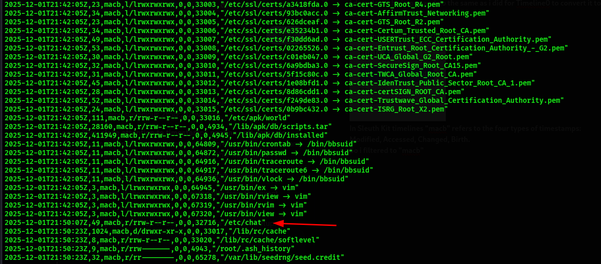
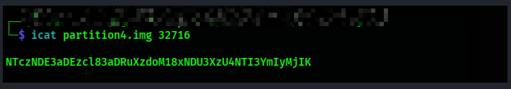
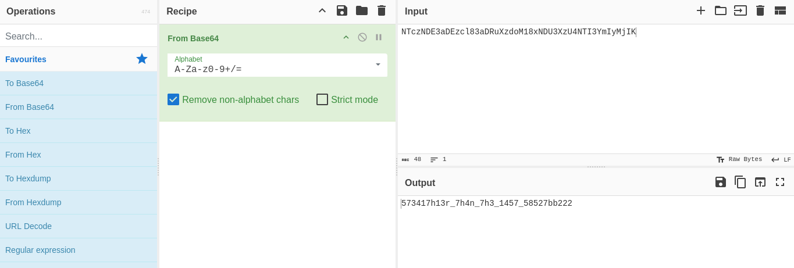

**First i generate  the body file: I use fls tool which scans the partition and creates a machine-readable list of all files, including hidden and deleted ones, along with their metadata. 

-r recurse through all directories and -m / sets the mounting point prefix

**Second i convert to a CSV Timeline. I use mactime to make that body file and format it into a chronological CSV so that i can open it in LibreOffice Calc.

-b points to generated .txt, -d output in comma-delimited format and -y uses ISO 8601 date format
**The hint says

This hint mean that .attacker attempted to hide a file by changing its timestamps but made a mistake in the process.

**So we will look at a very old time
From the .csv i found an old date 

I tried reading the file and got 

I decoded the base64 string in cyberchef 

Then i wrap the flag picoCTF{71m311n3_0u7113r_h3r_43a2e7af}

---

TIMELINE 1

**I download the image and do the same as i did for Timeline0 to convert it to .csv

**This time around one of the hint says

In Sleuth Kit timelines "macb" refers to the four types of timestamps: Modified, Accessed, Changed, Birth.
So i filtered to "macb"
Then i opened it and found an unusual file for standard setup

I opened it and found a base64 string and decoded it with cyberchef and got the flag

The flag is picoCTF{573417h13r_7h4n_7h3_1457_58527bb222}
