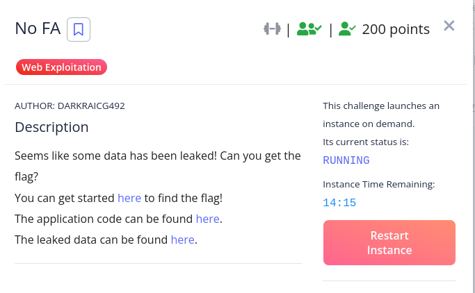
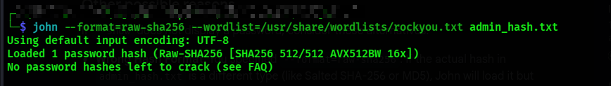
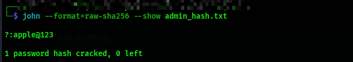
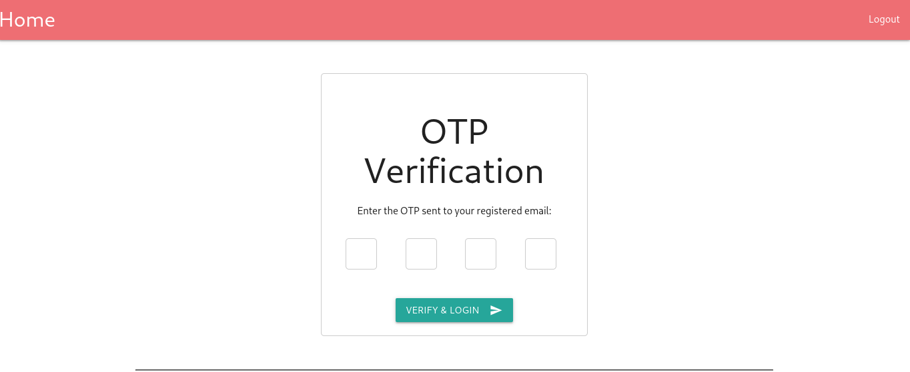
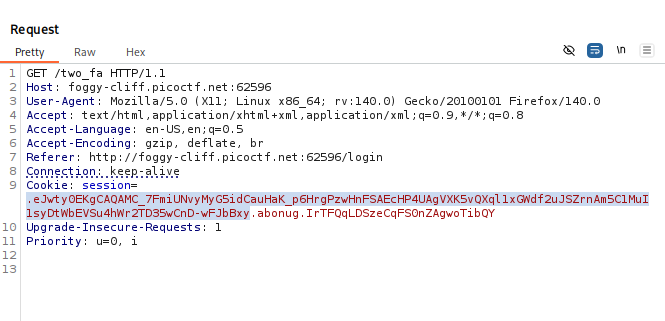

**Description

**First we are given the db of users and their hashes. We will use john to crack the admins hash.

Since i already cracked the password i get "No password hashes left to crack (see FAQ)"
So i will retrieve the cracked password

**After entering the password i must enter OTP for verifying

**NOTE: In flask, session objects acts as dictionary that is stored directly in computer rather than in server.
In login() function, when user successfully enters their password and has 2FA enabled, the code does 
"otp = str(random.randint(1000, 9999))
session['otp_secret'] = otp"
By assigning otp to session['otp_secret'], Flask serializes the 4-digit number and puts it inside the cookie.
The sessions are signed not encrypted so the data itself is just Base64-encoded JSON

**Exploitation

I take the highlighted part of the session and decode it in cyberchef

Then i enter the otp_secret value in the /two_fa endpoint.

**Flag
![[NoFA_flag.png]](images/NoFA_flag.png)
The Flag is::
picoCTF{n0_r4t3_n0_4uth_9617ed73}

**Conclusion
The OTPs must be stored server-side only, and using proper 2FA mechanisms like TOPTP apps, SMS/email codes where secret is generated and validated on the server
