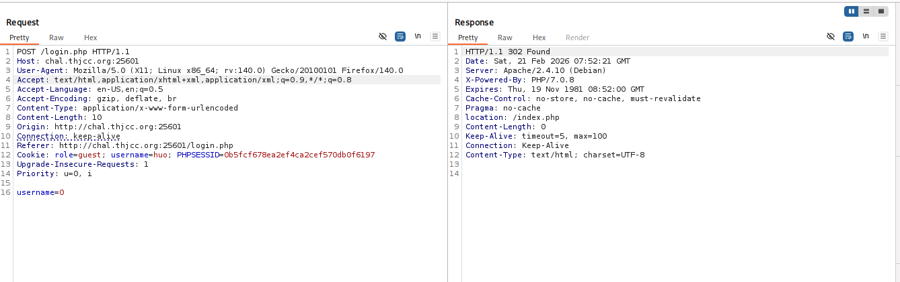
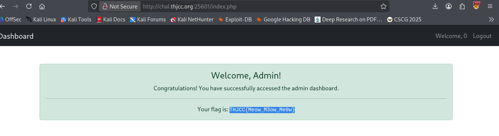

**PHP Type Juggling (Loose Comparison)**
### Challenge

The application used loose comparison in PHP 7.0.

### Vulnerability

In `indexController.php`:

the check is:  
`if ($key == 'admin')`

- Loose comparison (`==`) between integer and string.
    
- `"admin"` converts to `0` when compared to a number.
    
- `0 == 'admin'` becomes `0 == 0`, which is true.

### Exploit Path

1. Login with `username=0`.
    
2. Session stored as `$_SESSION['perms'][0] = 'guest_access'`.
    
3. Index loop compared key `0` to `'admin'`.
    
4. Loose comparison evaluated true → admin privileges granted.

### Note

Fixed in PHP 8.0, where `"admin" == 0` evaluates to false.

### Flag

`THJCC{Meow_M3ow_Me0w}`

SOLUTION:

