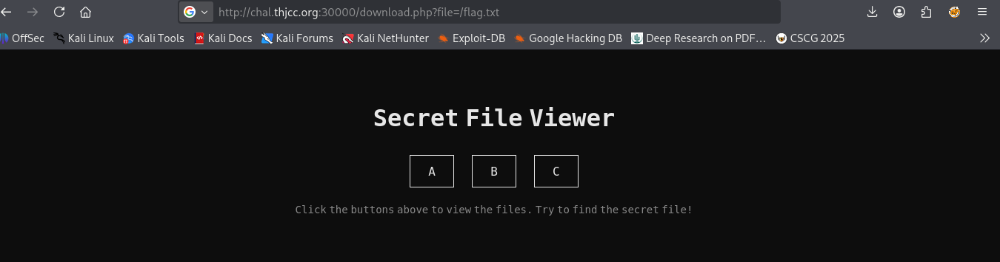
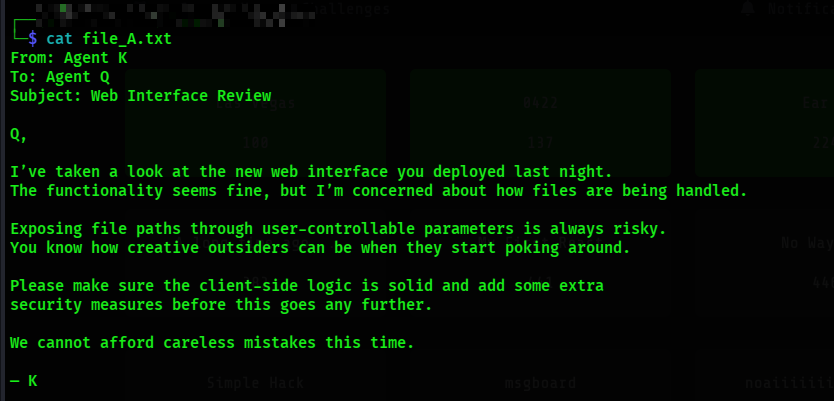
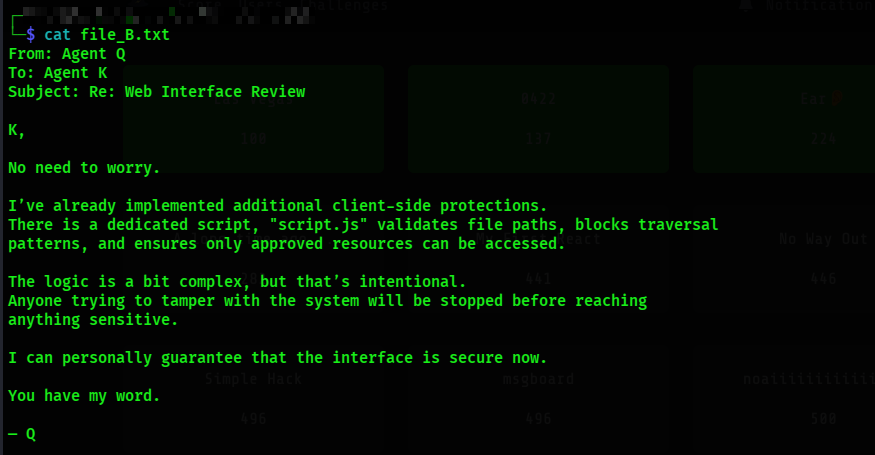
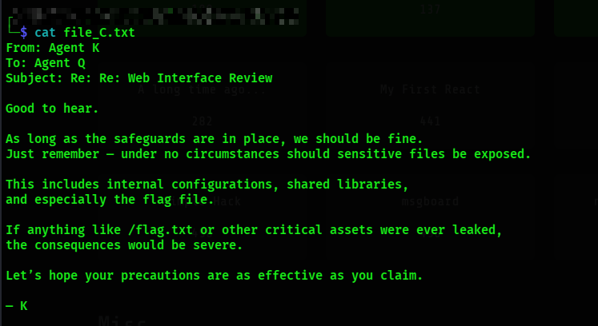
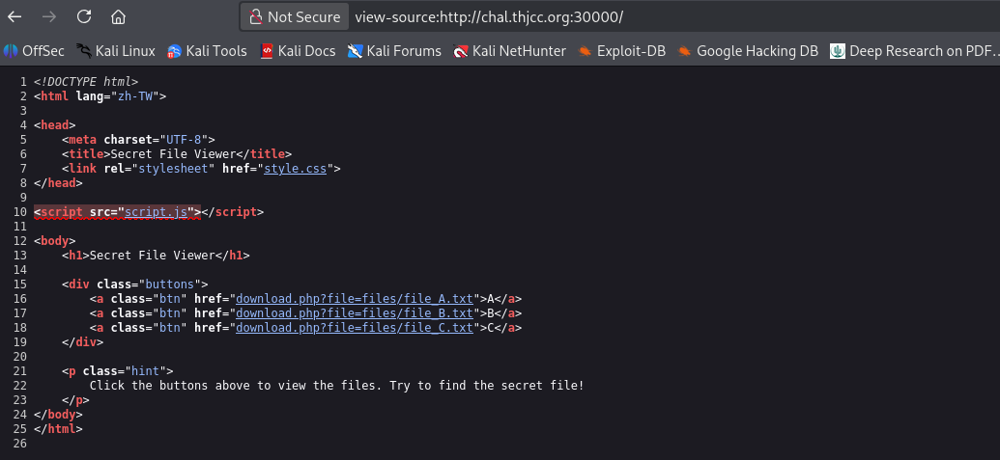
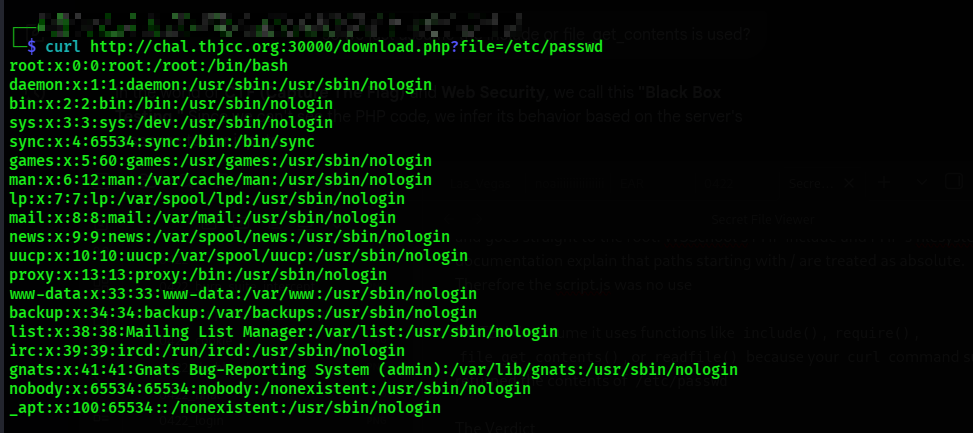
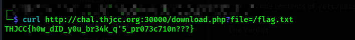

## Initial Observation##

We were provided with files **A–C**, which contained captured conversations and application components.

From the analysis of `script.js`, we identified that it functions as a **Client-Side Path Traversal (CSPT) protection module**.

/etc/passwd

No traversal was necessary.

The current directory is files from downloads.php, files is not root::

But wait!! In PHP, if a script uses a function like file_get_contents($file), or include($$file), and you provide /etc/passwd, the OS ignored whatever current directory the sript is in and goes straight to the root. W3School's PHP include and PHP's filesystem documentation explain that paths starting with / are treated as absolute.
Therefore the script.js was no use

From the above image, you can see i did not have to traverse to reach the root and access /etc/passwd.

FLAG::`THJCC{h0w_dID_y0u_br34k_q'5_pr073c710n???}`

