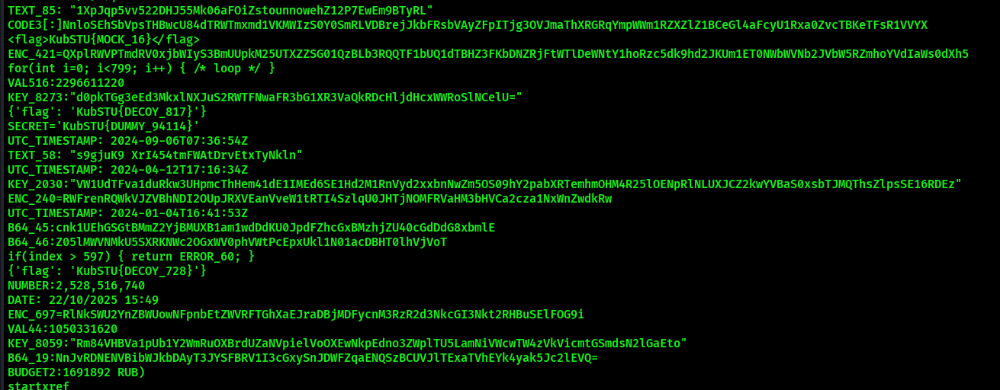
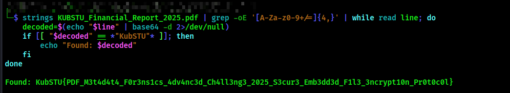

**Description**

I am given a PDF file here:

First i use Strings command to see if there is any thing useful. 
I tried to grep for the flag using the format ***kubSTU{}*** but did not get anything

But there are a lot of base64 encoded strings:

So i wrote i a simple script:

1) It searches for every sequence of 4 or more base64 characters in the file.
2) It decodes every single on of them
3) It then prints results if the decoded string contains the string ***kubSTU***

And i got the flag:

