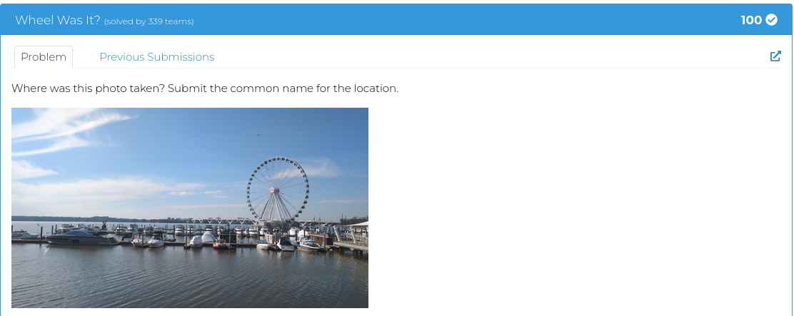
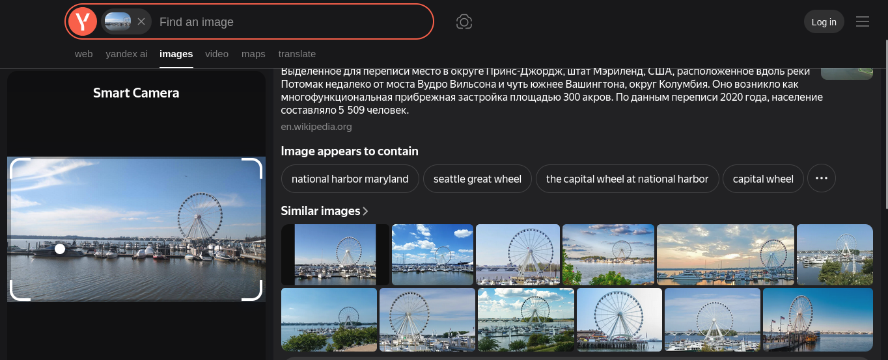
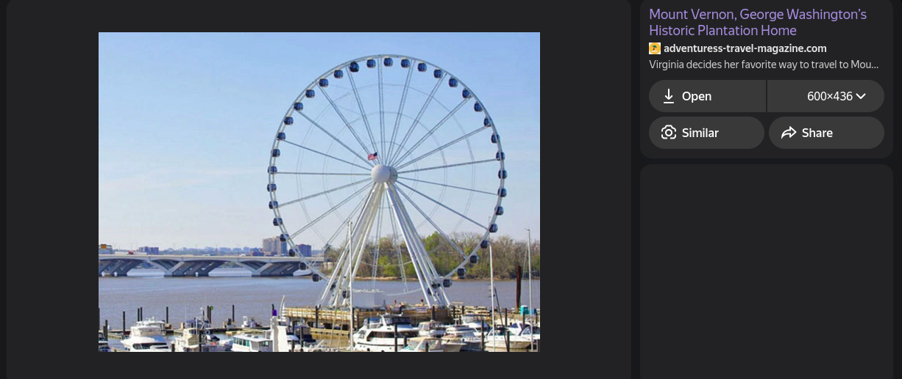
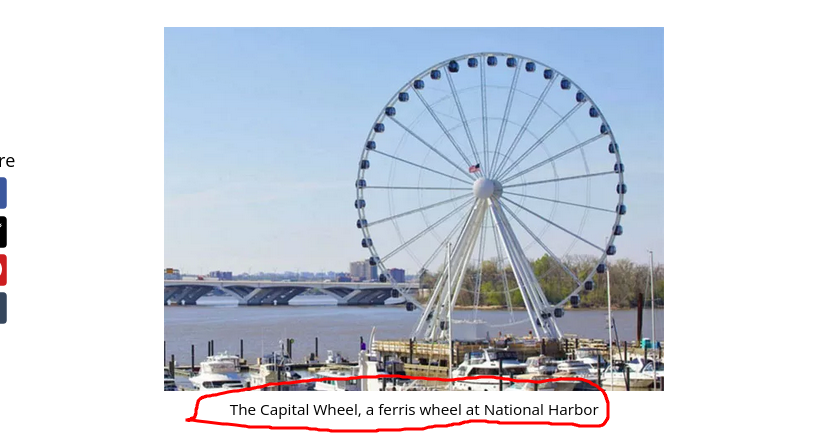
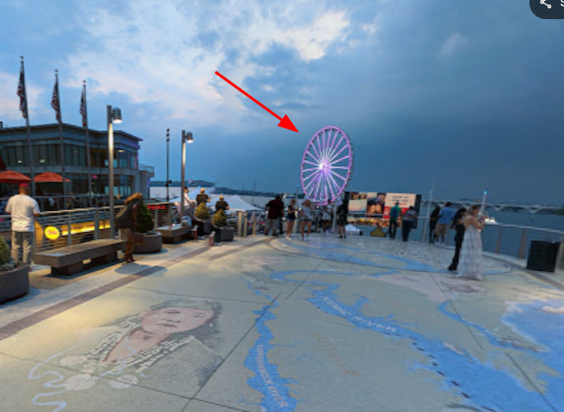
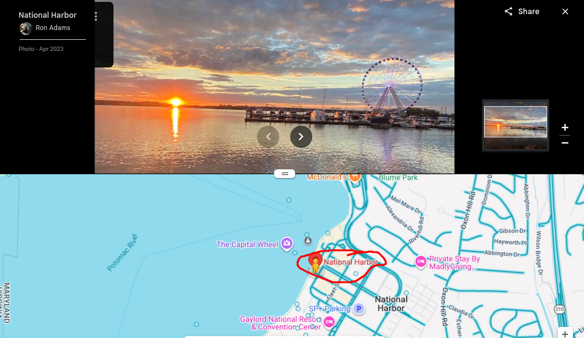

OSINT Challenge

**DESCRIPTION**

Step 1: I used Yandex image search to look for similar pictures.

And I found a hit:

Step 2: I followed the [Mount Vernon, George Washington’s Historic Plantation Home](https://www.adventuress-travel-magazine.com/mount-vernon.html?utm_medium=organic&utm_source=yandexsmartcamera) link which took me to adventuress-travel-magazine.com. Within the magazine, I found a similar picture with the caption "The Capital Wheel, a ferris wheel at National Harbor".

Step 3: I confirmed my findings via Google Maps. 

I see the wheel.

We are looking for where the picture was taken.

I looked through the pictures attached, and the view here is similar to the one from the challenge.

