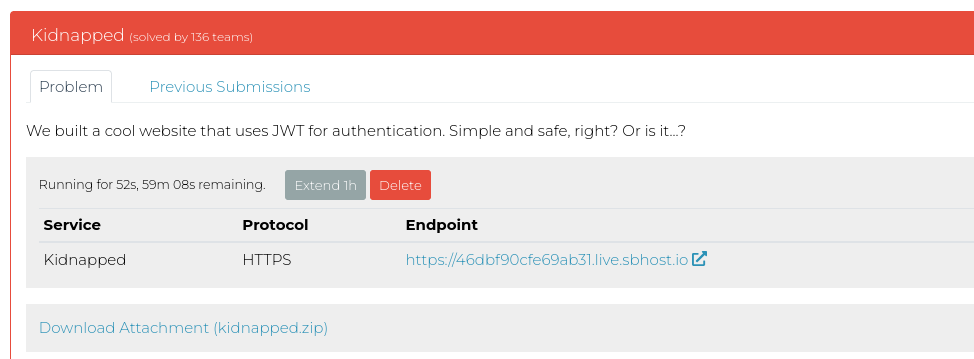
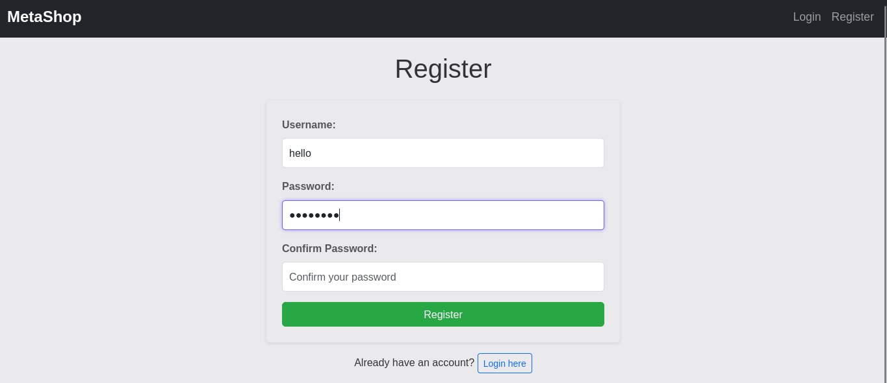
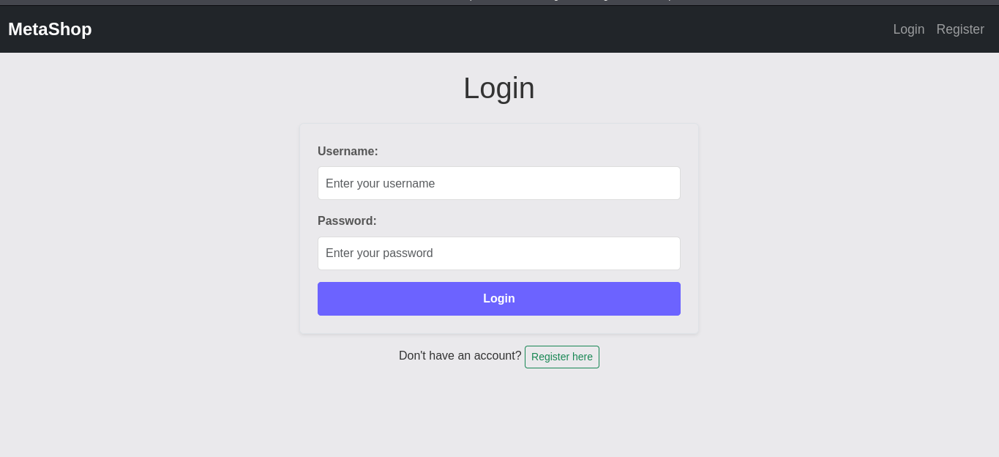
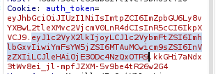
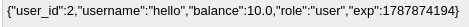
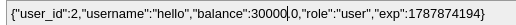
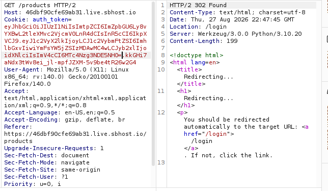
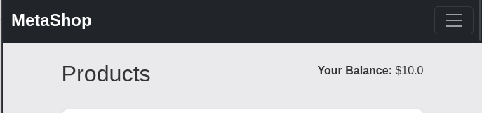
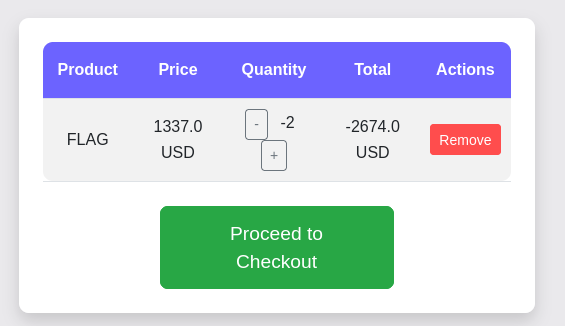
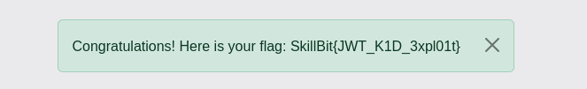

Web Challenge: Business Logic Vulnerability

We are given the app file but i will attempt black-box.

I Register a username and passwords and login

Challenge description says "We built a cool website that uses JWT for authentication" so i target JWT.
I will attempt to manipulate the auth_token to get the flag:

I target the highlighted part. 

I change the balance

Burp response redirects me to /login and my price does not change

Second test, i target the quantity parameter within /add_to_cart/21

I change it to a lower number to decrease its price. It did not work when i change in browser, so i used burpsuite intercept.

I proceed to checkout and get the flag
